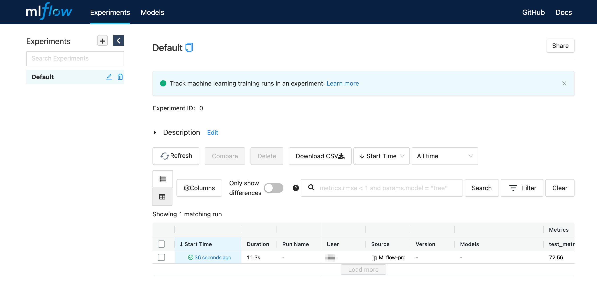
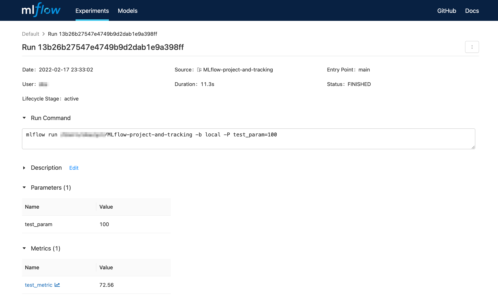
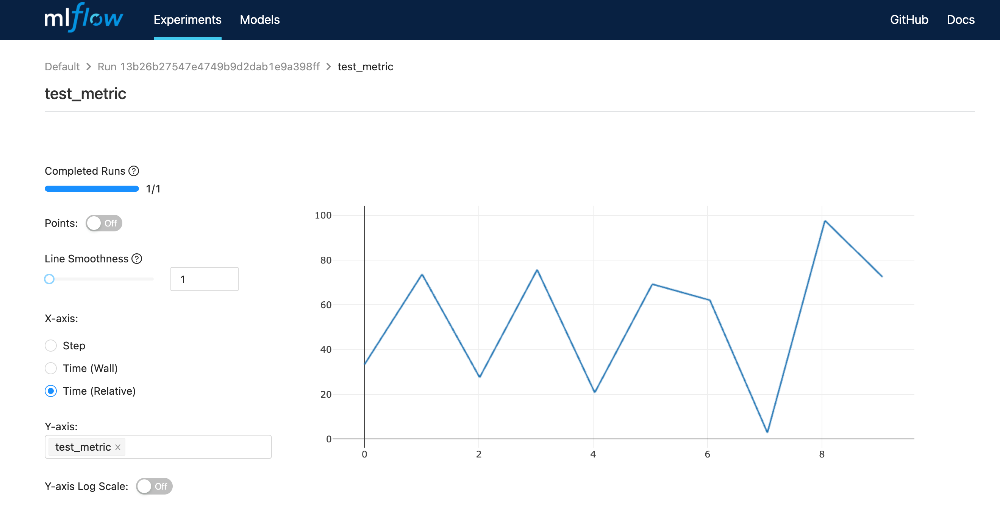

# MLflow Projects + Tracking

[MLflow](https://www.mlflow.org/) の [Projects](https://www.mlflow.org/docs/latest/projects.html) と [Tracking](https://www.mlflow.org/docs/latest/tracking.html) を紹介している記事はよく見るけど、合わせて使っている記事を見かけなかったのでメモ。

## 確認した環境

- Python 3.9.10
- mlflow==1.23.1

## 動かし方

Python 3.8 以降 ([`f'{expr=}'`の記法](https://docs.python.org/3/whatsnew/3.8.html#f-strings-support-for-self-documenting-expressions-and-debugging)を使用しているため) で、 mlflow と tqdm をインストールします。

```sh
pip install mlflow tqdm
```

その上で以下を実行すると `MLproject` に書かれた内容が実行されます。ここで MLflow はデフォルトで conda 環境を使いますが、今回は使わずに実行しています。

```sh
mlflow run --no-conda .
```

`MLproject` は以下のような内容になっています。

```yaml
name: projects-and-tracking

entry_points:
  main:
    command: |
      env | grep MLFLOW && \
      python track.py --mlflow_run_id $MLFLOW_RUN_ID
```

miflow 内で `env | grep MLFLOW` が実行されると `MLFLOW_RUN_ID`, `MLFLOW_TRACKING_URI`, `MLFLOW_EXPERIMENT_ID` が表示されて、これらの環境変数が定義されていることが分かります。このうち `MLFLOW_RUN_ID` を使えば、今まさに実行中の run に対して parameter や metric を記録できます。そこで `python track.py --mlflow_run_id $MLFLOW_RUN_ID` のように引数で run ID を渡します。(なお Python 内で 環境変数から run ID を取得することもできますが、明確に引数に入れたほうがスケジューラ経由で実行する場合などにも使えて汎用性があると思われます。)

`track.py` の中身は以下のようになっています。

```python
import argparse
import os
import random
import time

import mlflow
import tqdm

def main():
    parser = argparse.ArgumentParser()
    parser.add_argument('--mlflow_run_id')
    args = parser.parse_args()

    print(f"{args.mlflow_run_id=}")
    print(f"{os.environ['MLFLOW_RUN_ID']=}")

    if args.mlflow_run_id:
        client = mlflow.tracking.MlflowClient()
        client.log_param(run_id=args.mlflow_run_id, key="test_param", value=100)
        for step in tqdm.tqdm(range(10)):
            v = random.random()*100
            client.log_metric(run_id=args.mlflow_run_id, key="test_metric", value=v, step=step)
            time.sleep(1)


if __name__ == '__main__':
    main()
```

実行に10秒かかるので、終わったら以下のコマンドで UI サーバーを起動します。

```sh
mlflow ui
```

5000番ポートが空いていない場合は `mlflow ui --port 空いているポート番号` のようにします。ブラウザで <http://localhost:5000> を開くと、以下のようになっているかと思います。







なお MLflow の run の記録方法は色々ありますが、今回はローカルに記録しています。

## 参考リンク

- [python 3.x - Can MLFlow log new metrics in a terminated run? - Stack Overflow](https://stackoverflow.com/a/67473790/11480802)
